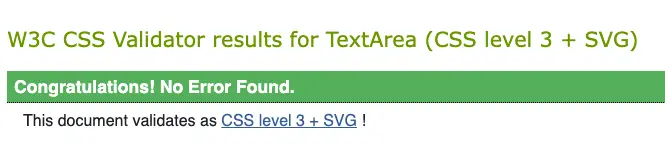
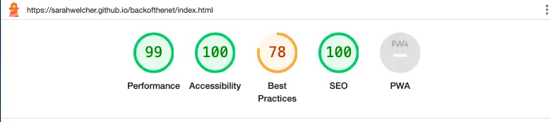

# Back of the net

This website is designed to be responsive on a range of devices.

Back of the net website allows users to play a fun football quiz with a total of 15 questions.

[Back of the net is available to view on Github pages](https://sarahwelcher.github.io/backofthenet/index.html)

***

## Table of Contents

- [User Experience (UX)](#user-experience-ux)
    - [Key Information](#key-information)
    - [First Time User Goals](#first-time-user-goals)
    - [Returning User Goals](#returning-user-goals)
- [Design](#design)
    - [Wireframes](#wireframes)
    - [Colors](#colors)
    - [Typography](#typography)
    - [Images](#images)
    - [Accessibility](#accessibility)
- [Structure](#structure)
    - [Homepage](#homepage)
    - [Game](#game)
    - [Features](#features)
    - [Future Features](#future-features)
- [Technology Used](#technology-used)
- [Testing](#testing)
    - [W3 Validator results](#w3-validator-results)
    - [Jigsaw results](#jigsaw-results)
    - [Jest results](#jest-results)
    - [Other Testing](#other-testing)
    - [Lighthouse Results](lighthouse-results)
        - [Mobile](#mobile)
        - [Desktop](desktop)
- [Bugs & Issues](#bugs--issues)
    - [Resolved issues](#resolved-issues)
    - [Unresolved issues](#unresolved-issues)
- [Deployment](#deployment)
    - [How to fork](#how-to-fork)
    - [How to clone](#how-to-clone)
- [Tutorials Used](#tutorials-used)
- [Credits](#credits)
- [Acknowledgements](#acknowledgements)

***

## User Experience (UX)
### Key Information

- 15 general knowledge football questions.

### First time user goals

- To have a responsive website for different screen sizes.
- To be able to take part in a fun football related quiz.
- To have questions about both mens and womens football teams.
- To have a simple, easy to navigate website.

### Returning user goals

- To be able to play again.
- To be able to log scores on a leaderboard.

***

## Design

### Wireframes

Basic wireframes were created for mobile, tablet and desktop using Balsamiq.

Home

Game

### Colors

The Chelsea Football Club team colors used were found on [Team Color Codes](https://teamcolorcodes.com/chelsea-color-codes/#:~:text=Chelsea%20colors%20are%20blue%2C%20red,Chelsea%20is%20West%20Ham%20United.)

The color palette for these colors was created using [Coolors](https://www.coolors.co/).

### Typography

Google fonts was used to select the typography used within the website. Bungee was primarily used across the site, with sans-serif as fall back.

### Images

Background image was found on [Freepik](https://www.freepik.com/images)

### Accessibility

I have attempted to make the website as accessible as possible by using colors that contrast well, using semantic HTML.

## Structure

### Homepage

The homepage was designed to be simple for users, showing a short welcome message, a modal (pop-up) to show the quiz rules, and a start game button.

### Game

The game consists of a question and four answer buttons. Each correct question will then be added to the score which will appear after the first correct answer.
The final result will then be shown with a congratulatory message.

***

## Features

- This website is targeting people who enjoy football and completing quizzes.
- They are able to answer multiple choice questions about both mens and womens football.
- There are 15 questions.
- Responsive on all device sizes.

### Homepage

- The homepage is a simple, easy to navigate page with 2 buttons. 
- One button opens a modal to show the game rules.
- One button starts the game.

Homepage

### Game Rules Modal

- The game rules modal opens to show the rules. This puts a slight overlay over the homepage and has an X in the top right corner to close the modal again.

Modal

### Game interface

- Again, a simple easy to navigate page with a question shown, and 4 answer options. 
- Answers are on individual buttons.
- Users can click the button they think contains the correct answer, and the question will then move on to the next one.

Game interface

### Score Counter

- For each correctly answered question, the score counter will go up by 1.

Score counter

### Final result

- At the end of the 15 questions, the final score will be shown with a message congratulating the user for finishing the quiz.

Final result

### Footer

- Credits the background image.
- Fixed at bottom of all pages.

Footer

### Future Features

- In future I would like to add a leaderboard - this is something that was planned but unfortunately ran out of time to add at present.
- Colour highlighting to show whether an answer was correct or incorrect. If incorrect, this will also highlight what the correct answer actually was.
- Easy, medium and hard levels.

***

## Technology Used

- HTML, CSS & Javascript were used to create the website
- Gitpod & Github
- All wireframes were created using [Balsamiq](https://balsamiq.com/)
- [Google fonts](https://fonts.google.com/) was used for all typography
- [amiresponsive](https://ui.dev/amiresponsive) was used for the mock ups
- [CloudConverter](https://cloudconvert.com/) for converting from png/jpeg to webp

***

## Testing

### Manual vs Automation testing

- Automated testing is good for checking simple tasks, particularly more repetitive tasks, whereas manual is good for testing complex tasks.

### W3 Validator results

index.html

game.html

### Jigsaw Results

### Jest Results

### Other Testing
- Links between pages were all working throughout the coding process.
- Chrome dev tools was used throughout to check responsiveness.

| What was done | Working correctly? |
|---------------------|:---------------------:|
| I checked that the "Game Rules" and "Start Game" buttons work by clicking on them      | Yes|
| I Checked whether the font changes color and buttons increase in size when hovered over with mouse       |Yes|
| I Checked each function in javascript worked before moving on to the next one       |Yes|

### Lighthouse Results

#### Mobile

Homepage

Game

#### Desktop

Homepage

Game

***

## Bugs & Issues

### Resolved issues

- One question was not increasing the score when correct answer selected - This was fixed after a spelling error was found.

### Unresolved issues

***

## Deployment

GitHub Pages used to deploy live version of the website.

- Log in to GitHub and locate GitHub Repository Back of the net
- At the top of the Repository click settings
- Scroll down the settings page and click on pages (found on the left)
- Under "Source", select 'deploy from a branch' from the dropdown menu
- Under "branch", check that "main" is selected
- Save and refresh to get the link to deployed site (could take up to 10 minutes)

### How to fork

- Log in to GitHub and locate GitHub Repository Back of the net
- In the top right corner of the page, click fork
- Under "Owner," select the dropdown menu and click an owner for the forked repository.
- By default, forks are named the same as their upstream repositories. Optionally, to further distinguish your fork, in the "Repository name" field, type a name.
- Optionally, in the "Description" field, type a description of your fork.
- Optionally, select Copy the DEFAULT branch only.
- For many forking scenarios, such as contributing to open-source projects, you only need to copy the default branch. If you do not select this option, all branches will be copied into the new fork.
- Click Create fork.

### How to clone

- On GitHub.com, navigate to the main page of the repository.
- Above the list of files, click Code.
- Copy the URL for the repository.
- To clone the repository using HTTPS, under "HTTPS", click the clipboard icon.
- To clone the repository using an SSH key, including a certificate issued by your organization's SSH certificate authority, click SSH, then click the clipboard icon .
- To clone a repository using GitHub CLI, click GitHub CLI, then click copy icon .
- Open Terminal.
- Change the current working directory to the location where you want the cloned directory.
- Type git clone, and then paste the URL you copied earlier.
- Press Enter to create your local clone.

***

## Tutorials used

- [Medium](https://medium.com/@codepicker57/building-an-interactive-quiz-with-html-css-and-javascript-efe9bd8129e2)
- [W3 Schools](https://www.w3schools.com/)
- [A Smarter Way to Learn JavaScript](https://www.amazon.co.uk/Smarter-Way-Learn-JavaScript-technology-ebook/dp/B00H1W9I6C/ref=tmm_kin_swatch_0?_encoding=UTF8&qid=&sr=)

## Credits

- [Coolors contrast checker](https://coolors.co/contrast-checker/112a46-acc8e5)
- [Freepik](https://www.freepik.com/images) was used for website background image
- [Radio Times](https://www.radiotimes.com/quizzes/pub-quiz-football/) for some of the questions and answers
- [Free Pub Quiz](http://www.freepubquiz.co.uk/womens-football-quiz.html) for the rest of the questions and answers

## Acknowledgements

- My Mentor Mitko Bachvarov, for all his help and advice.
- My uncle Tim who helped me to get things working and understand where I was going wrong.